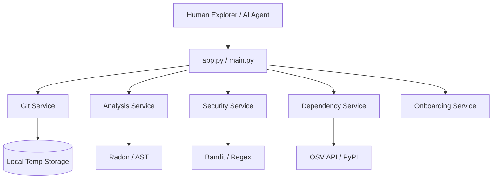

# 🏺 Codebase Archaeologist Architecture

The Codebase Archaeologist is a modular repository analyzer that exposes its insights through a Model Context Protocol (MCP) server for AI agents and a Gradio web interface for human explorers.

## 🏗️ System Overview

The application follows a **Service-Oriented Architecture (SOA)**, where each archaeological "dig technique" is isolated into its own service.

## 🛠️ Key Components

### 1. The Entry Points
- **`main.py` (MCP Server)**: Uses FastMCP to register tools. It provides the "eyes and ears" for AI agents like Claude or Cursor.
- **`app.py` (Gradio UI)**: A premium "Industrial Utilitarian" dashboard for visual analysis.

### 2. The Dig Services
- **`GitService`**: Handles shallow cloning (`depth=1`) and repository size validation. It ensures local cleanup after every scan.
- **`AnalysisService`**: Performs structural analysis using Python's `ast` module and `radon` for cyclomatic complexity.
- **`SecurityService`**: A dual-layered scanner using static regex patterns (secrets/SQLi) and the Pro-grade `Bandit` analyzer with a 60s safety timeout.
- **`DependencyService`**: Queries the Google OSV (Open Source Vulnerabilities) database across Python (PyPI) and Node.js (npm) ecosystems.
- **`EffortService`**: A deterministic calculation engine that predicts refactoring time based on complexity weightings.

## 🛡️ Hardening & Privacy
- **Path Redaction**: All error messages are sanitized to prevent the disclosure of local system directory structures.
- **Data Disposal**: Temporary clones are purged immediately after the analysis report is built.
- **Rate Limit Defense**: Authenticated GitHub API checks avoid rate-limiting during size validation.
